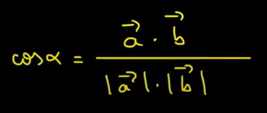

Image Removal API!

For now, running yarn dev will not work so to run this project. You need to run yarn build and then node dist/index.js

We used the dot product of two vectors to filter similarities

TODO: Check what are the new remaining files from filteredEmbeddings.json and return them to the client.